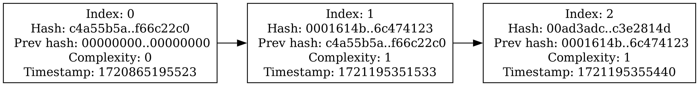

# Blockchain

Simple blockchain implementation for demo purposes.

## Usage

See [make targets](./Makefile) for available commands.

```shell
PORT=33400 GENESIS=00000000000000000000000000000000c4a55b5a7d0d89586e37238ca05362389e0dd85157d8652bd24fc483f66c22c0000000000000000000000000000000000000000000000000000000000000000003068fab900100000000000000000000000000000000000000000000000000000000000000000000000000000000000000000000000000000000000000000000000000000000000000000000000000000000000000000000000000000000000000000000000000000000000000000000000000000000000000000000000000000000000000000000000000000000000000000000000000000000000000000000000000000000000000000000000000000000000000000000000000000000000000000000000000000000000000000000000000000000000000000000000000000000000000000000000000000000000000000000000000000000000000000000000000000000000000 \
  make run

MINING=1 NODES=127.0.0.1:33400 GENESIS=00000000000000000000000000000000c4a55b5a7d0d89586e37238ca05362389e0dd85157d8652bd24fc483f66c22c0000000000000000000000000000000000000000000000000000000000000000003068fab900100000000000000000000000000000000000000000000000000000000000000000000000000000000000000000000000000000000000000000000000000000000000000000000000000000000000000000000000000000000000000000000000000000000000000000000000000000000000000000000000000000000000000000000000000000000000000000000000000000000000000000000000000000000000000000000000000000000000000000000000000000000000000000000000000000000000000000000000000000000000000000000000000000000000000000000000000000000000000000000000000000000000000000000000000000000000000 \
  make run
```

Or you can use predefined commands:

```shell
make run_ln
make run_fn
```

### Docker

```shell
make build_docker
# -it to use ctrl+c
docker run --rm -it blockchain
```

```shell
make build_docker && docker run --rm -it -e PORT=33400 -e GENESIS=00000000000000000000000000000000c4a55b5a7d0d89586e37238ca05362389e0dd85157d8652bd24fc483f66c22c0000000000000000000000000000000000000000000000000000000000000000003068fab900100000000000000000000000000000000000000000000000000000000000000000000000000000000000000000000000000000000000000000000000000000000000000000000000000000000000000000000000000000000000000000000000000000000000000000000000000000000000000000000000000000000000000000000000000000000000000000000000000000000000000000000000000000000000000000000000000000000000000000000000000000000000000000000000000000000000000000000000000000000000000000000000000000000000000000000000000000000000000000000000000000000000000000000000000000000000000 \
  --name light-node --net host blockchain

docker run --rm -it -e MINING=1 -e NODES=127.0.0.1:33400 -e GENESIS=00000000000000000000000000000000c4a55b5a7d0d89586e37238ca05362389e0dd85157d8652bd24fc483f66c22c0000000000000000000000000000000000000000000000000000000000000000003068fab900100000000000000000000000000000000000000000000000000000000000000000000000000000000000000000000000000000000000000000000000000000000000000000000000000000000000000000000000000000000000000000000000000000000000000000000000000000000000000000000000000000000000000000000000000000000000000000000000000000000000000000000000000000000000000000000000000000000000000000000000000000000000000000000000000000000000000000000000000000000000000000000000000000000000000000000000000000000000000000000000000000000000000000000000000000000000000 \
  --name full-node --net host blockchain
```

Or you can use predefined commands:

```shell
make run_docker_ln
make run_docker_fn
```

## Graph

In order to generate blockchain graph use following command:

```shell
make gen_graph
```

### Example



## Troubleshooting

To test UDP server use following command: `echo "test" | nc -u -w 1 127.0.0.1 44600`.
